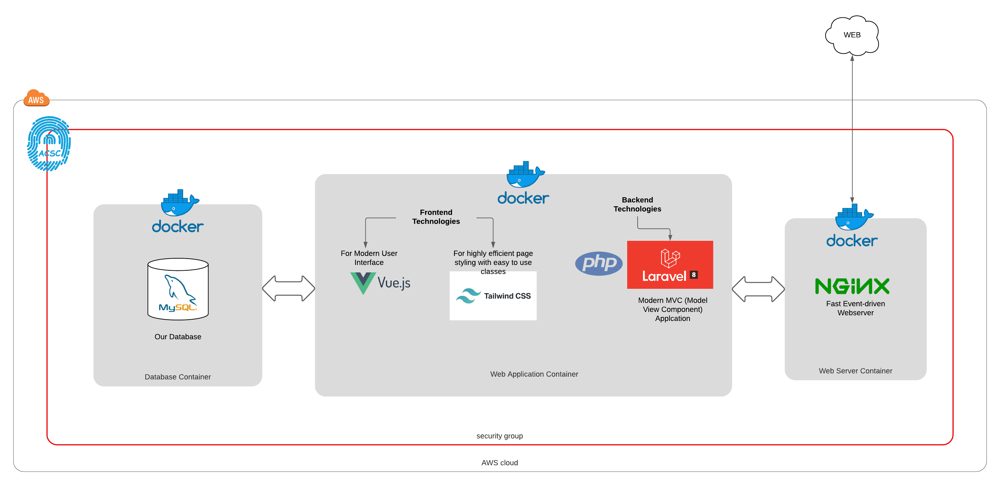

# **ZERO TO DOCKER**

## DISCLAIMER
This Application is built using Free and Open Source Technologies, for Educational purposes, and is not intended for profit or malice. You are free to use the code base for your personal needs.

## The Application: Zero To Docker (ZTD)
The ZTD App is a simple MVC Web Application, which uses the default scaffolding of a Laravel 8 PHP MVC Application, and containerized using Docker. This implementation demonstrates some of the current _Industry DevSecOps Best Practice Standards_ in building a fully containerized Web Applications using Docker.

## Technologies used in this project
- [laravel](https://laravel.com/docs)
- [Docker](https://www.docker.com/)
- [NGINX](https://www.nginx.com/)
- [MySQL](https://www.mysql.com/)
- [Git](https://git-scm.com/)
- [Composer](https://getcomposer.org/)
- [NodeJS](https://nodejs.org/en/)

## Prerequisites
In order to successfully run this project, please ensure that the following tools / technologies are installed locally on your machine:
* Docker
* PHP7.2 (or newer)
* MYSQL Community Server (Note: Don't need to install this on your machine, as we will be running it inside a Docker Container.)
* Git (Version Control System):
    * Ensure to create a Github Account (It is free)
* Composer (Dependency Manager for PHP)
* NPM (Javascript Package Manager) Note: _This will be installed with NodeJS above._

## Steps To Run the Application Locally
1. Create a new parent directory for you to store this project. Eg. 'MyProjects'
2. Go into 'MyProjects', open that folder in the command-line, and run the following _git command_ to _clone_ the project into your local machine.
```
git clone https://github.com/DintogaeSpiritEagle/ztd-app.git ztd
```
When completed. You will now have a new folder named _ztd_ which contains all the project files. Go into this directory to confirm that all the files are there.

3. Copy `.env.example` to `.env`.
```
cp .env.example .env
```
4. Check your _docker-compose.yml_ file to verify that it contains the necessary configurations to build the following containers:
* _nginx_ Web Server Container
* _php_ Web Application Container
* _mariadb_ Mariadb (MYSQL) Database Container
6. Build your docker containers and provision your new environments using the commands below, whilst in your _ztd_ directory:

Build Steps:
* Build the containers: `docker-compose up -d --build`
* Install the Dependencies: `docker exec -it php composer install`
* Clear caches: `docker exec -it php make clearcaches`
* Run the database migrations on the web app (ie. php) container: `docker exec -it php make dbmigration`. If containers build without errors, then proceed to step (7). If errors occur, then run the Troubleshoot steps below.

*Troubleshoot Containers:*
If the containers fail to build, then you may need to delete the docker images cache, and re-build the containers:
```
$ docker image prune -a                                                                                        
WARNING! This will remove all images without at least one container associated to them.
Are you sure you want to continue? [y/N] y
``` 
Then rebuild the containers:
```
docker-composer up -d --build
```

7. In your terminal, run `docker ps -a` to see the containers that you just created. Confirm that they are all running.
```
CONTAINER ID   IMAGE        COMMAND                  CREATED         STATUS                   PORTS                  NAMES
07f0b973da07   nginx        "/docker-entrypoint.…"   4 seconds ago   Up 3 seconds             0.0.0.0:8080->80/tcp   nginx
86fde0142d39   ztd2_php     "docker-php-entrypoi…"   5 seconds ago   Up 3 seconds             9000/tcp               php
402839fe349a   mariadb:10   "docker-entrypoint.s…"   6 seconds ago   Up 5 seconds (healthy)   3306/tcp               mariadb
```
8. Here are the links to your newly created Dockerized Web Application:

* [Home Page](http://localhost:8080)
* [Register New User](http://localhost:8080/register)
* [Login to ZTD](http://localhost:8080/login)

9. To stop and remove your running containers, run the following `docker` command:
```
docker stop nginx php mariadb && docker rm nginx php mariadb
```
or run:
```
docker-compose down -v
```
And to rebuild your docker containers, do steps 1-8 again.

Enjoy!

For More Information on any future Webinars, please visit our website at [https://www.arkcybersecurityconsultants.com/](https://www.arkcybersecurityconsultants.com/)
